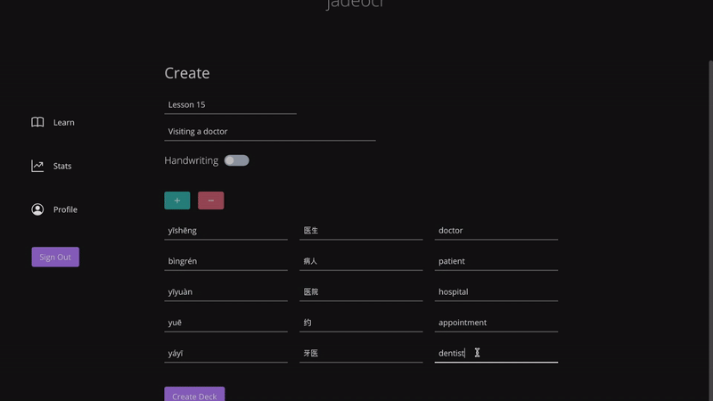

# jadeocr
Elegant [spaced-repetition](https://en.wikipedia.org/wiki/Spaced_repetition) flashcards with handwriting recognition for learning languages — [jadeocr.com](https://jadeocr.com)




## Features
* [x] Handwriting recognition
* [x] Spaced repetition flashcards
* [x] Multilingual support
* [x] Elegant UI 


## Built With
* [Keras](https://keras.io)
* [Vue.js](https://vuejs.org)
* [Firebase](https://firebase.google.com/)
* [Node.js](https://nodejs.org)


## Quickstart
In the **jadeocr-webapp** directory, run the following to quickly spin up a development instance.
```bash
$ yarn install    # Installs dependencies
$ yarn twbuild    # Builds Tailwind CSS files
$ yarn serve      # Compiles/hot-reloads dev server
```

### Adding Firebase
To add the backend, create a project in [Firebase](https://firebase.google.com). Copy the JS config snippets from the Firebase console into the `firebaseConfig` in **jadeocr-webapp/src/firebase/credentials.js** to add the SDK credentials.
```javascript
export default {
  firebaseConfig: {
    apiKey: "API_KEY",
    authDomain: "AUTH_DOMAIN",
    ...
  }
}
```

### Development
```bash
$ yarn serve      # Compiles/hot-reloads dev server
$ yarn build      # Compiles/minifies -> dist for production
$ yarn lint       # Lints/fixes files
```

### Deployment
```bash
$ yarn deploy   # Builds, deploys to Firebase Hosting, and removes dist
```


## OCR CNN
Currently, jadeocr uses the Google Cloud Vision API to handle handwriting recognition. In the future, we would like to implement custom neural network for better detection of languages not using the Latin script.

The OCR neural network is trained on a 100-class subset of the [CASIA Chinese Handwriting Dataset](http://www.nlpr.ia.ac.cn/databases/handwriting/Home.html). To train on the full dataset effectively, it is necessary to have more training examples per class.

### Dependencies
Create a virtual environment and install dependencies with:
```bash
$ cd convnet && virtualenv env     # Creates virtual env
$ source env/bin/activate          # Activates virtual env
$ pip3 install -r requirements.txt # Installs dependencies
```

### Obtaining the Dataset
To obtain the full dataset, download [**HWDB1.1train_gnt (2741MB)**](http://www.nlpr.ia.ac.cn/databases/download/feature_data/HWDB1.1trn.zip) and [**HWDB1.1test_gnt (681MB)**](http://www.nlpr.ia.ac.cn/databases/download/feature_data/HWDB1.1tst.zip) and extract the zip files. Store them in the directory **convnet/data** and check that the extracted folders are named **HWDB1.1trn_gnt** and **HWDB1.1tst_gnt**, respectively.

### Preprocessing
Run **convnet/src/preprocess.py** to convert from GNT to png.

### Training
Run **convnet/src/train.py** to train the model. You can tweak the hyperparameters at the top of the file.

### Prediction
Save an image **convnet/data/tests/test.png** that you would like to have the network predict to and run **convnet/src/predict.py**.


## Contribute
Thank you for reading this far and considering contributing! Contributions are very much appreciated, and they are what makes this project what it is! We are looking for contributions of features/feature requests, bug fixes, documentation fixes, and anything else you can think of! The best contributions are those that will add value to the user experience. If you need to get in touch, please see the [contact/help](#Contact/Help) section.

Please take a look at the information below before contributing. Also, please take a look at the [code of conduct](https://github.com/TanayB11/jadeocr/blob/master/CODE_OF_CONDUCT.md). We expect that you follow these standards, and we will enforce them. Please report any violations by sending me an <a href='mailto: devs@jadeocr.com'>email</a>. 

### Issues
Browse through the [issues](https://github.com/TanayB11/jadeocr/issues) or submit one. Here are a couple guidelines to follow:
* Make sure all of your dependencies are up to date
* Include steps to reproduce the issue
* Expected behavior and what went wrong
* Screenshots/terminal output if necessary

### Pull Requests
Pull requests are also always welcome. Here are a couple simple guidelines:
* Make sure your code is readable and commented when necessary
* Document your changes adequately when opening a pull request

### Donations
If jadeocr has been of some value to you, and if you can afford it, please consider buying us some 奶茶. Your donations will also support the development of new features and code maintenance. Here's how you can donate:
* BTC: `15Y9NZjxTLWHDU8kVsqN7FKey3c1RPNiFi`
* [Venmo](venmo.com/Tanayb11)
* [Paypal](https://www.paypal.me/TanB11)

Thank you so much for taking the time to contribute!


## Credits
* [integeruser](https://github.com/integeruser/CASIA-HWDB1.1-cnn)
* [想飞的石头](https://zhuanlan.zhihu.com/p/24698483)
* [蹦跶的小羊羔](https://blog.csdn.net/yql_617540298/article/details/82740382)
* [Suragch](https://stackoverflow.com/questions/49047159/spaced-repetition-algorithm-from-supermemo-sm-2)


## Contact/Help
If you would like to get in touch with me for any (legitimate) reason, please do not hesitate to 
<a href='mailto: devs@jadeocr.com'>contact</a> me. If you need more help, please open an issue or send me an email (if an issue isn't appropriate).


## License
This repository is licensed under the MIT License.

[Tanay Biradar](https://github.com/TanayB11)

